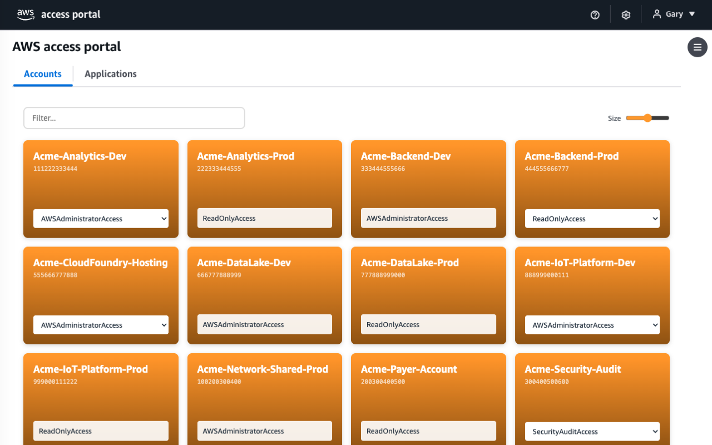

# AWS Access Portal Prettifier

A Chrome extension that transforms the default AWS IAM Identity Center (SSO) access portal into a clean, card-based interface.

## Features

- 🟧 Orange gradient cards replacing the default account table
- 🔽 Dropdown role selector for multi-role accounts
- 🖱️ Click any card to open the AWS Console in a new tab
- 💾 Remembers your last-used role per account
- 🔍 Instant filter/search by account name or ID
- 📐 Adjustable card size (small / medium / large)
- 🔤 Alphabetically sorted accounts
- 🌏 Works on both `*.awsapps.com` and `*.awsapps.cn`
- 🔒 Zero permissions, no data collection, fully client-side

## Install

### Chrome Web Store

Coming soon.

### Manual

1. Clone this repo or download the zip
2. Open `chrome://extensions/`
3. Enable **Developer mode** (top right)
4. Click **Load unpacked** and select the extension folder

## How It Works

1. Hides the original portal table immediately via CSS
2. Expands all account rows to discover available IAM roles
3. Renders accounts as orange cards with role dropdowns
4. Clicking a card opens the console federation URL in a new tab

## Privacy

No data is collected or transmitted. Preferences (card size, last-used role) are stored in `localStorage` only. See [Privacy Policy](PRIVACY.md).

## License

MIT
